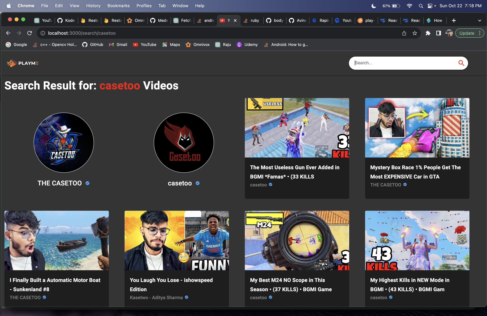
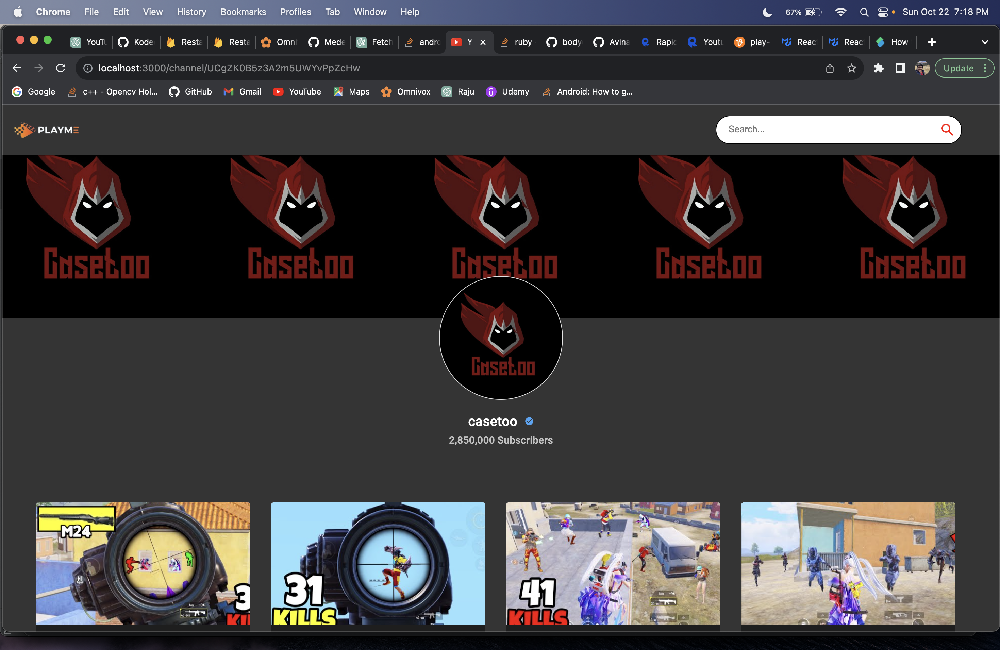

# Welcome to Personal Video Player 

---

## **Introduction**

This project is a personal video player, built using [React.js](https://reactjs.org/) and [Material-UI](https://mui.com/). It mimics some basic functionalities of YouTube, allowing users to search for videos and view video details.

## Features

- **Search Videos:** Users can search for videos by entering keywords in the search bar.
- **Video Playback:** Videos can be played within the application.
- **Channel Information:** Provides information about the channel associated with the video.
- **Responsive Design:** The application is designed to be responsive, providing a seamless experience across devices.


## Technology

```
Frontend : React JS, Material-UI, HTML5, CSS3, JavaScript

API   : Rapid-API
```

**Sample Page Images**

---

**1) Home Page**

---

</a>

**2) Search Page**

---

</img>

**3) Video Page**

---

</img>

**4) Channel Page**

---

</img>
